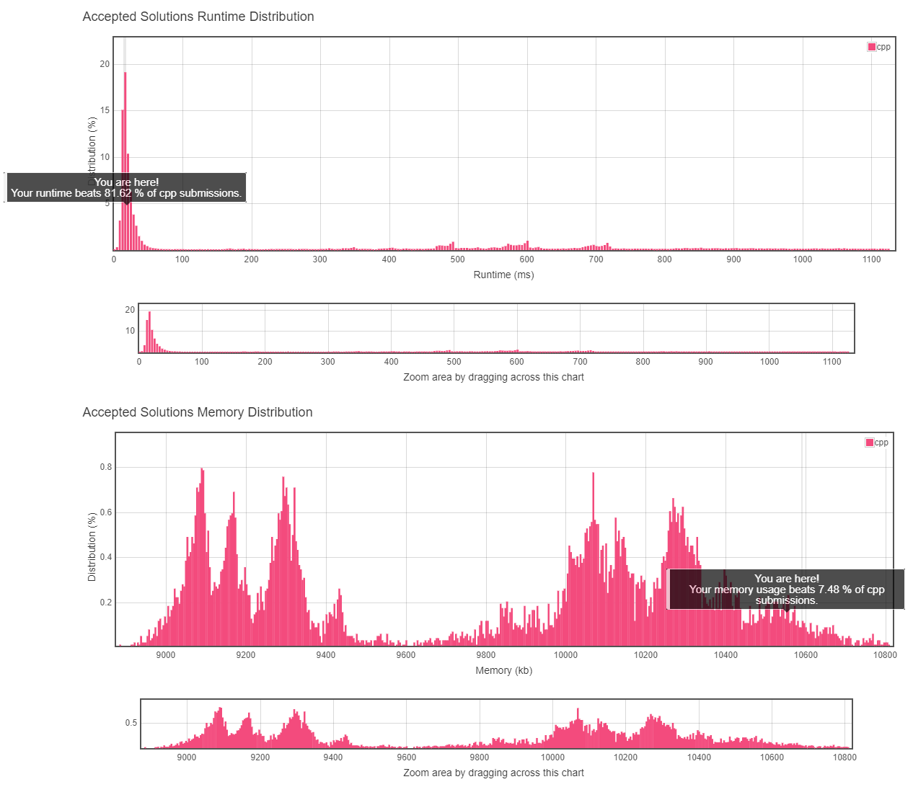
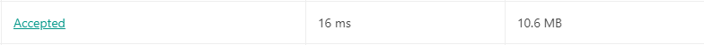

# 1. Two Sum

## TOC
- [1. Two Sum](#1-two-sum)
  - [TOC](#toc)
  - [Difficulty](#difficulty)
  - [Localizaiton](#localizaiton)
  - [Problem Description](#problem-description)
  - [Solution](#solution)
  - [Result](#result)
  
## Difficulty
**Easy**

[Leetcode Link](https://leetcode.com/problems/two-sum/)

## Localizaiton
[Simpfiled Chinese Version(TBD)](README.zh.MD)

[Japanese Version(TBD)](README.jp.MD)

## Problem Description

Given an array of integers, return **indices** of the two numbers such that they add up to a specific target.

You may assume that each input would have **exactly** one solution, and you may not use the same element twice.

**Example:**

```
Given nums = [2, 7, 11, 15], target = 9,

Because nums[0] + nums[1] = 2 + 7 = 9,
return [0, 1].
```

## Solution
```
TODO
```

## Result



