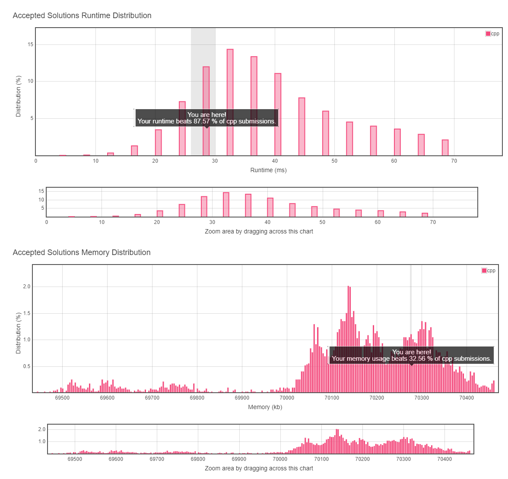

# 2. Add Two Numbers

## TOC
- [2. Add Two Numbers](#2-add-two-numbers)
  - [TOC](#toc)
  - [Difficulty](#difficulty)
  - [Localizaiton](#localizaiton)
  - [Problem Description](#problem-description)
  - [Solution](#solution)
  - [Result](#result)
  
## Difficulty
**Medium**

[Leetcode Link](https://leetcode.com/problems/add-two-numbers/)

## Localizaiton
[Simpfiled Chinese Version(TBD)](README.zh.MD)

[Japanese Version(TBD)](README.jp.MD)

## Problem Description

You are given two **non-empty** linked lists representing two non-negative integers. The digits are stored in **reverse order** and each of their nodes contain a single digit. Add the two numbers and return it as a linked list.

You may assume the two numbers do not contain any leading zero, except the number 0 itself.

**Example:**
```
Input: (2 -> 4 -> 3) + (5 -> 6 -> 4)
Output: 7 -> 0 -> 8
Explanation: 342 + 465 = 807.
```

## Solution
```
TODO
```

## Result

