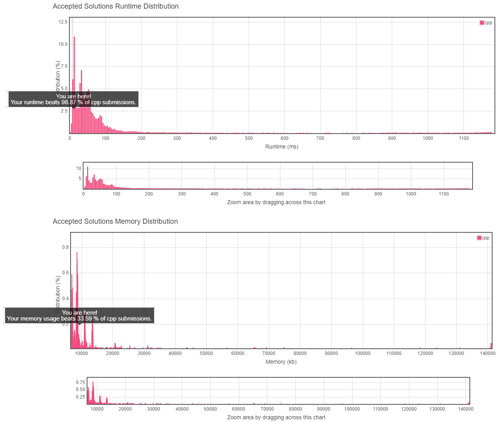

# 3. Longest Substring Without Repeating Characters

## TOC
- [3. Longest Substring Without Repeating Characters](#3-longest-substring-without-repeating-characters)
  - [TOC](#toc)
  - [Difficulty](#difficulty)
  - [Localizaiton](#localizaiton)
  - [Problem Description](#problem-description)
  - [Solution](#solution)
  - [Result](#result)
  
## Difficulty
**Medium**

[Leetcode Link](https://leetcode.com/problems/add-two-numbers/)

## Localizaiton
[Simpfiled Chinese Version(TBD)](README.zh.MD)

[Japanese Version(TBD)](README.jp.MD)

## Problem Description
Given a string, find the length of the **longest substring** without repeating characters.

[leet code link](https://leetcode.com/problems/longest-substring-without-repeating-characters/)

**Example 1:**
```
Input: "abcabcbb"
Output: 3 
Explanation: The answer is "abc", with the length of 3. 
```

**Example 2:**
```
Input: "bbbbb"
Output: 1
Explanation: The answer is "b", with the length of 1.
```

**Example 3:**
```
Input: "pwwkew"
Output: 3
Explanation: The answer is "wke", with the length of 3. 
             Note that the answer must be a substring, "pwke" is a subsequence and not a substring.
```

## Solution
```
TODO
```

## Result


