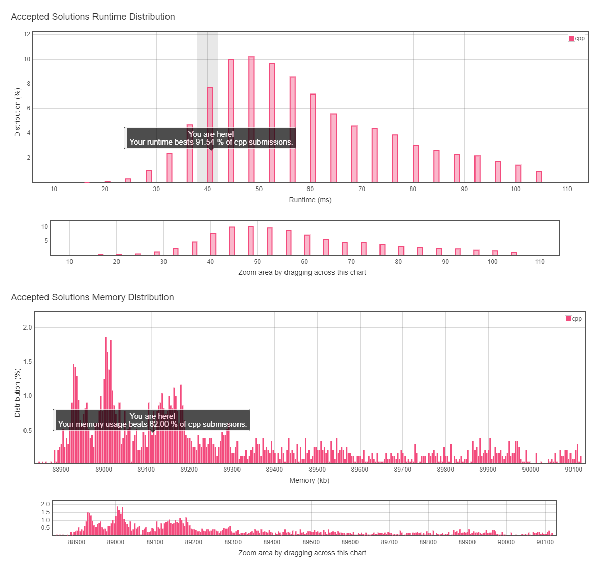

# 4. Median of Two Sorted Arrays

## TOC
- [4. Median of Two Sorted Arrays](#4-median-of-two-sorted-arrays)
  - [TOC](#toc)
  - [Difficulty](#difficulty)
  - [Localizaiton](#localizaiton)
  - [Problem Description](#problem-description)
  - [Solution](#solution)
  - [Result](#result)
  
## Difficulty
**HARD**

[Leetcode Link](https://leetcode.com/problems/median-of-two-sorted-arrays/)

## Localizaiton
[Simpfiled Chinese Version(TBD)](README.zh.MD)

[Japanese Version(TBD)](README.jp.MD)

## Problem Description
There are two sorted arrays **nums1** and **nums2** of size m and n respectively.

Find the median of the two sorted arrays. The overall run time complexity should be O(log (m+n)).

You may assume **nums1** and **nums2** cannot be both empty.

**Example 1:**
```
nums1 = [1, 3]
nums2 = [2]

The median is 2.0
```
**Example 2:**
```
nums1 = [1, 2]
nums2 = [3, 4]

The median is (2 + 3)/2 = 2.5
```
## Solution
```
TODO
```
## Result


