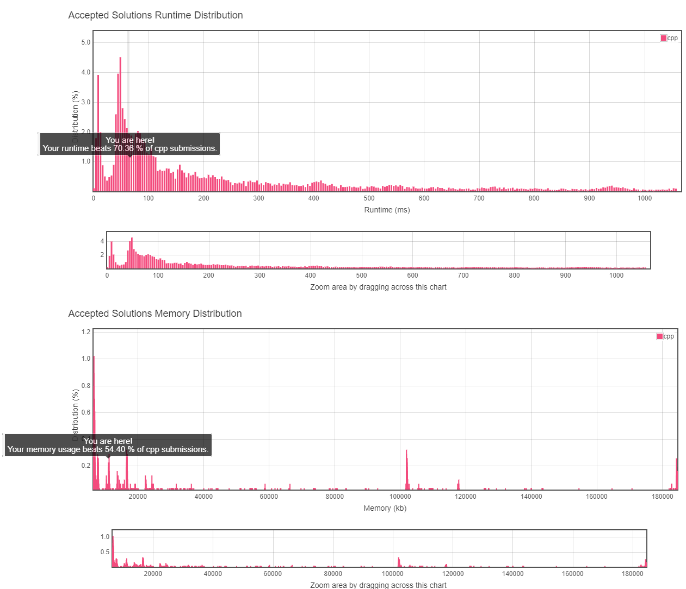

# 5. Longest Palindromic Substring

## TOC
- [5. Longest Palindromic Substring](#5-longest-palindromic-substring)
  - [TOC](#toc)
  - [Difficulty](#difficulty)
  - [Localizaiton](#localizaiton)
  - [Problem Description](#problem-description)
  - [Solution](#solution)
  - [Result](#result)
  
## Difficulty
**Medium**

[Leetcode Link](https://leetcode.com/problems/longest-palindromic-substring/)
## Localizaiton
[中文版本(TBD)](README.zh.MD)

[Japanese Version(TBD)](README.jp.MD)

## Problem Description
Given a string **s**, find the longest palindromic substring in **s**. You may assume that the maximum length of **s** is 1000.

Example 1:
```
Input: "babad"
Output: "bab"
Note: "aba" is also a valid answer.
```

Example 2:
```
Input: "cbbd"
Output: "bb"
```

## Solution
```
TODO
```
## Result


