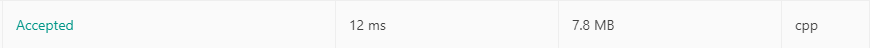

# 6. ZigZag Conversion

## TOC
- [6. ZigZag Conversion](#6-zigzag-conversion)
  - [TOC](#toc)
  - [Difficulty](#difficulty)
  - [Localizaiton](#localizaiton)
  - [Problem Description](#problem-description)
  - [Solution](#solution)
  - [Result](#result)
  
## Difficulty
**Medium**

[Leetcode Link]()
## Localizaiton
[中文版本(TBD)](README.zh.MD)

[Japanese Version(TBD)](README.jp.MD)

## Problem Description
The string `"PAYPALISHIRING"` is written in a zigzag pattern on a given number of rows like this: (you may want to display this pattern in a fixed font for better legibility)

```
P   A   H   N
A P L S I I G
Y   I   R
```
And then read line by line: "PAHNAPLSIIGYIR"

Write the code that will take a string and make this conversion given a number of rows:

string convert(string s, int numRows);

**Example 1:**

```
Input: s = "PAYPALISHIRING", numRows = 3
Output: "PAHNAPLSIIGYIR"
```

**Example 2:**
```
Input: s = "PAYPALISHIRING", numRows = 4
Output: "PINALSIGYAHRPI"
Explanation:

P     I    N
A   L S  I G
Y A   H R
P     I
```
## Solution
```
TODO
```
## Result


