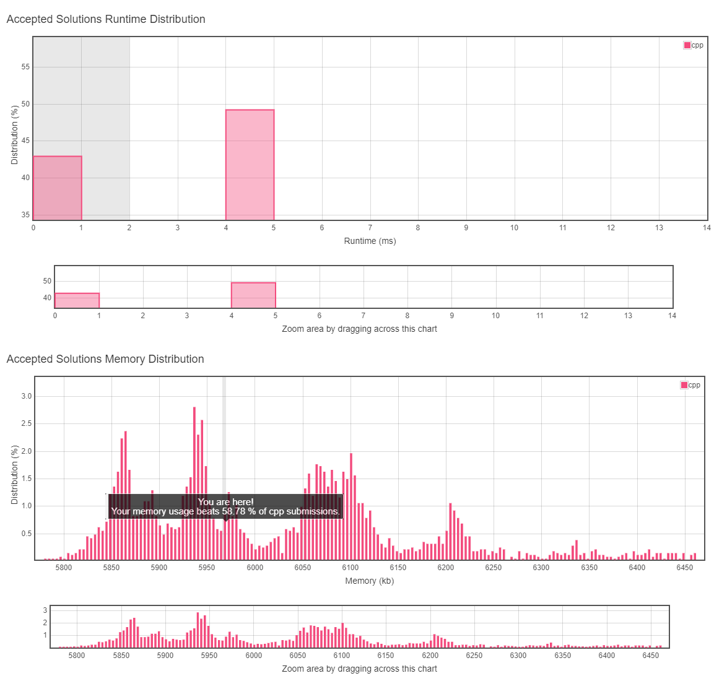
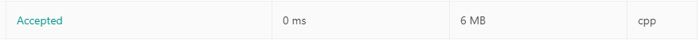

# 7. Reverse Integer

## TOC
- [7. Reverse Integer](#7-reverse-integer)
  - [TOC](#toc)
  - [Difficulty](#difficulty)
  - [Localizaiton](#localizaiton)
  - [Problem Description](#problem-description)
  - [Solution](#solution)
  - [Result](#result)
  
## Difficulty
**Easy**

[Leetcode Link](https://leetcode.com/problems/reverse-integer/)
## Localizaiton
[中文版本(TBD)](README.zh.MD)

[Japanese Version(TBD)](README.jp.MD)

## Problem Description
Given a 32-bit signed integer, reverse digits of an integer.

**Example 1:**
```
Input: 123
Output: 321
```
**Example 2:**
```
Input: -123
Output: -321
```

**Example 3:**
```
Input: 120
Output: 21
```

**Note:**
Assume we are dealing with an environment which could only store integers within the 32-bit signed integer range: \[,  ]. For the purpose of this problem, assume that your function returns 0 when the reversed integer overflows.

## Solution
```
TODO
```
## Result


